# 🎯 System Flow Diagram

## Complete Data Flow Architecture

---

## 📊 Main Workflow

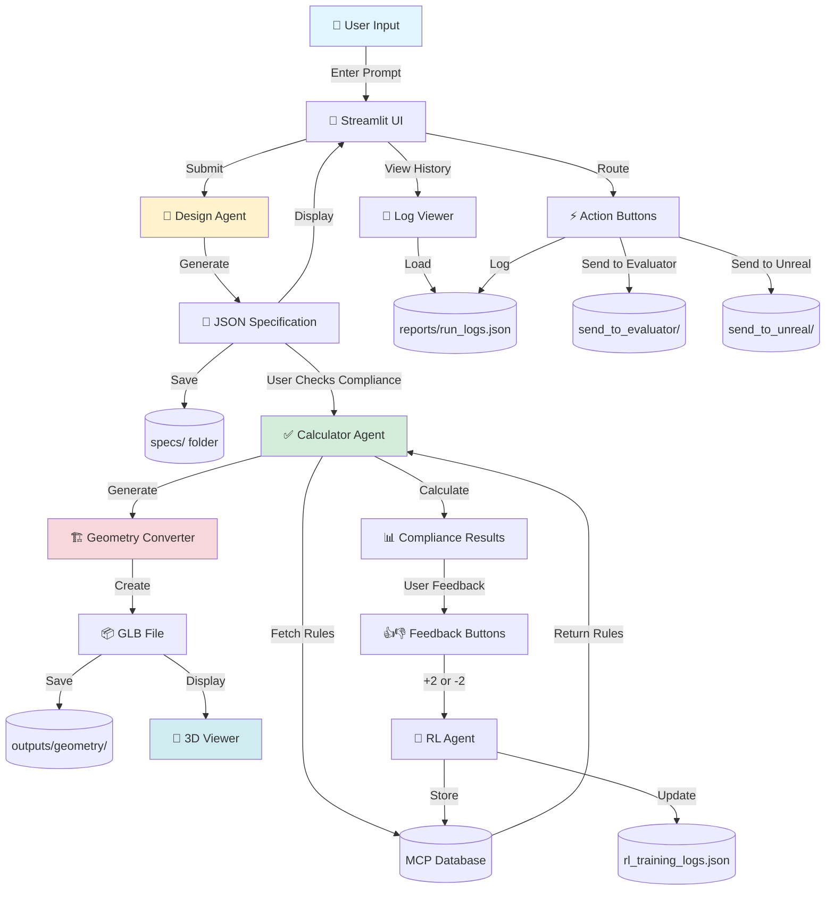

---

## 🔄 Detailed Component Flow

### 1. **Prompt Processing Flow**

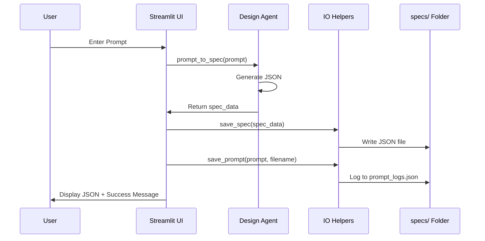

---

### 2. **Compliance Checking Flow**

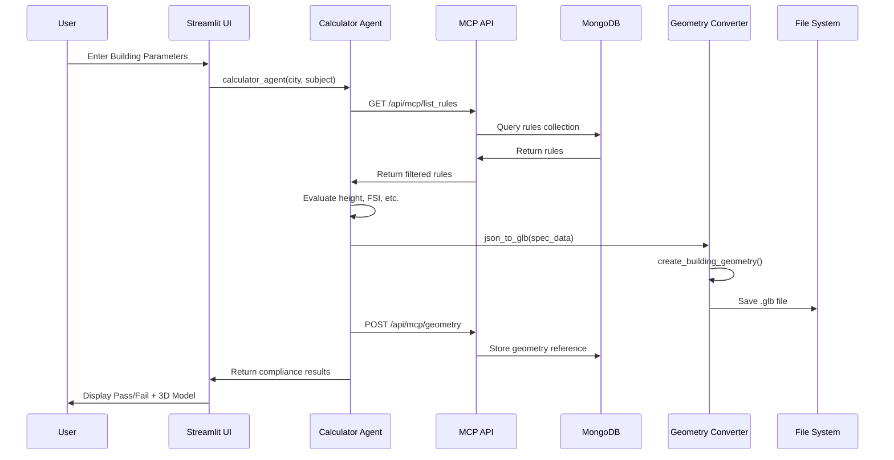

---

### 3. **RL Feedback Flow**

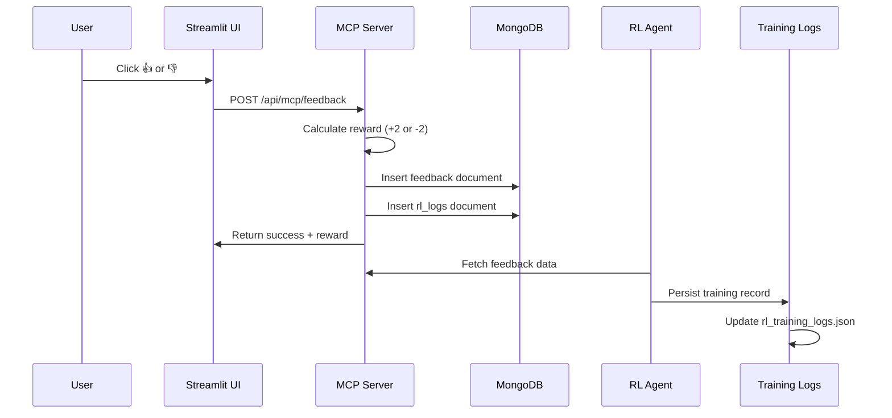

---

### 4. **3D Visualization Flow**

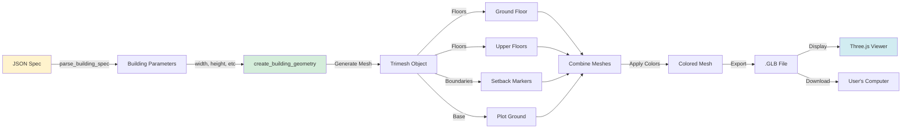

---

## 🗂️ Data Storage Architecture

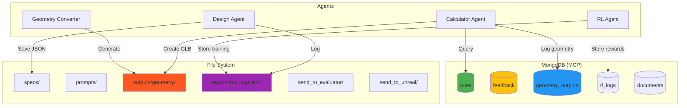

---

## 🔄 Multi-Agent Interaction

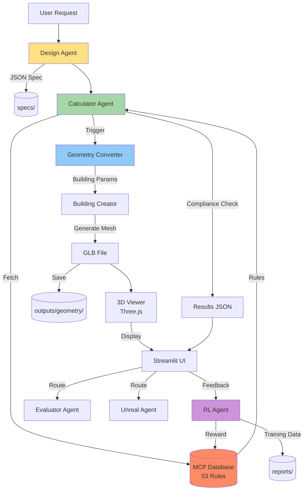

---

## 🏗️ Component Architecture

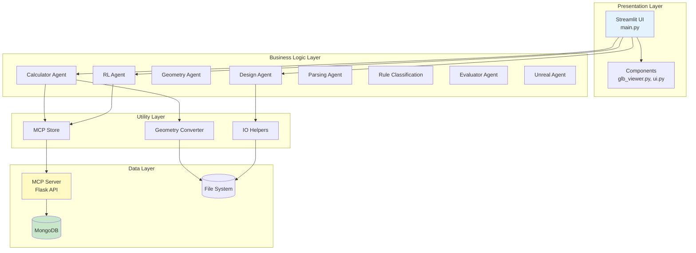

---

## 🌆 Multi-City Data Flow

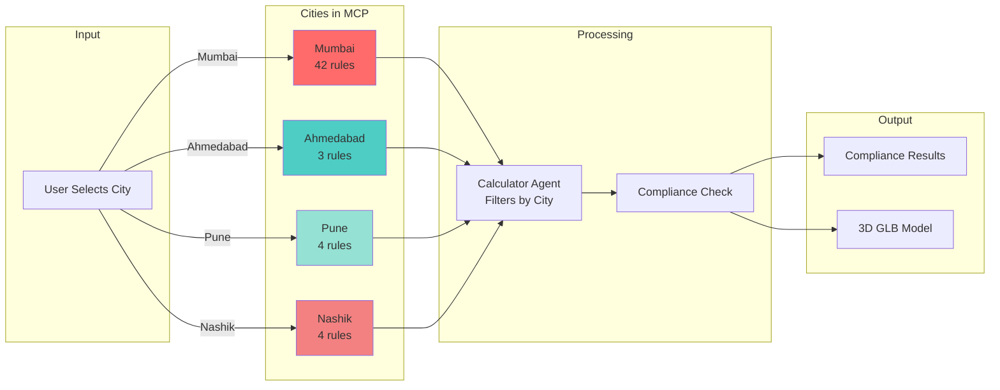

---

## 🔁 Complete System Cycle

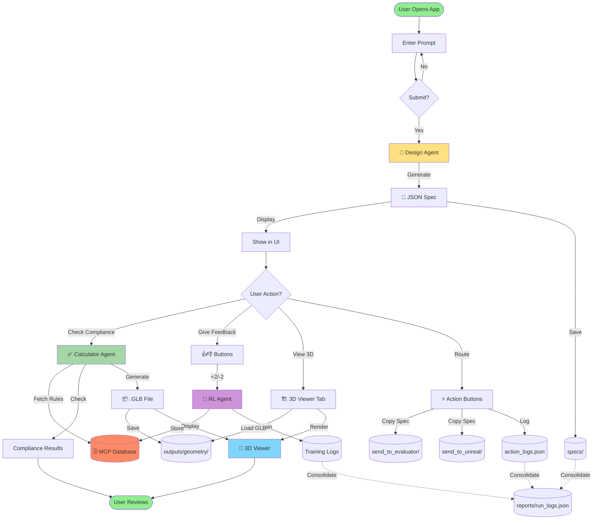

---

## 🎨 Frontend Component Tree

```
Streamlit App (main.py)
│
├── 📝 Prompt Input Section
│   ├── Text input box
│   ├── Submit button
│   └── Success message
│
├── 📄 JSON Specification Display
│   └── st.json() viewer
│
├── 👍👎 Feedback Section
│   ├── Good result button → +2 reward
│   └── Needs improvement → -2 reward
│
├── ✅ Compliance Checker
│   ├── City selector (4 cities)
│   ├── Building parameters input
│   │   ├── Height (m)
│   │   ├── Width (m)
│   │   ├── Depth (m)
│   │   ├── Setback (m)
│   │   └── FSI
│   ├── Check Compliance button
│   └── Results display (expandable)
│
├── 🏗️ 3D Geometry Viewer
│   ├── Tab 1: Current Model
│   │   └── Show current case GLB
│   └── Tab 2: Gallery View
│       ├── Dropdown selector
│       ├── 3D viewer (Three.js)
│       └── Download button
│
├── 📊 History Section
│   ├── Prompt Logs (left column)
│   └── Action Logs (right column)
│
└── 📂 Sidebar
    ├── Log Viewer
    │   ├── Past prompts dropdown
    │   └── JSON spec viewer
    └── Action Buttons
        ├── Send to Evaluator
        └── Send to Unreal Engine
```

---

## 🗄️ Database Schema (MongoDB)

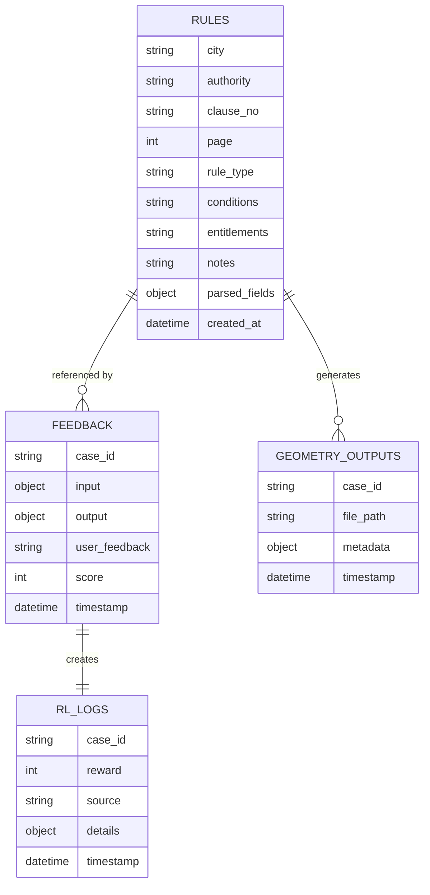

---

## 📁 File System Structure

```
Project Root
│
├── 📝 Specifications
│   └── specs/*.json (timestamped)
│
├── 🏗️ 3D Models
│   └── outputs/geometry/*.glb
│
├── 📊 Reports (Consolidated)
│   ├── run_logs.json (unified)
│   └── backups/ (timestamped)
│
├── ⚡ Agent Routing
│   ├── send_to_evaluator/*.json
│   └── send_to_unreal/*.json
│
└── 📚 Data Storage
    └── mcp_data/rules.json (local backup)
```

---

## 🔄 Agent Communication Flow

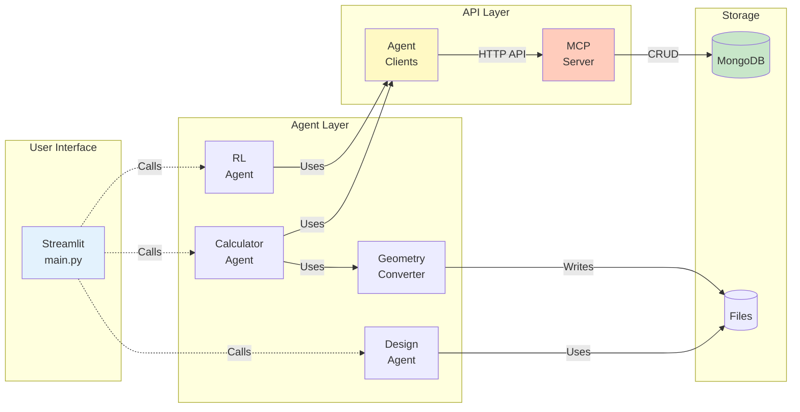

---

## 🎯 Request/Response Flow

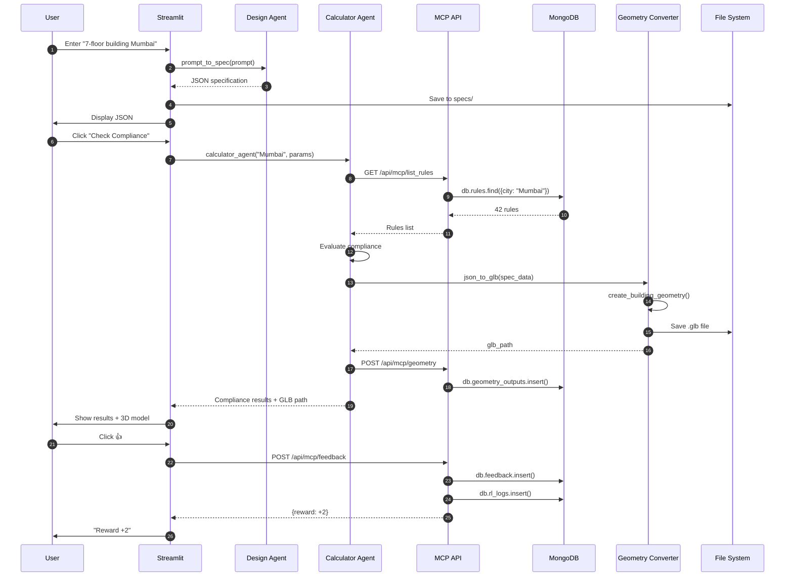

---

## 🌐 System Network Architecture

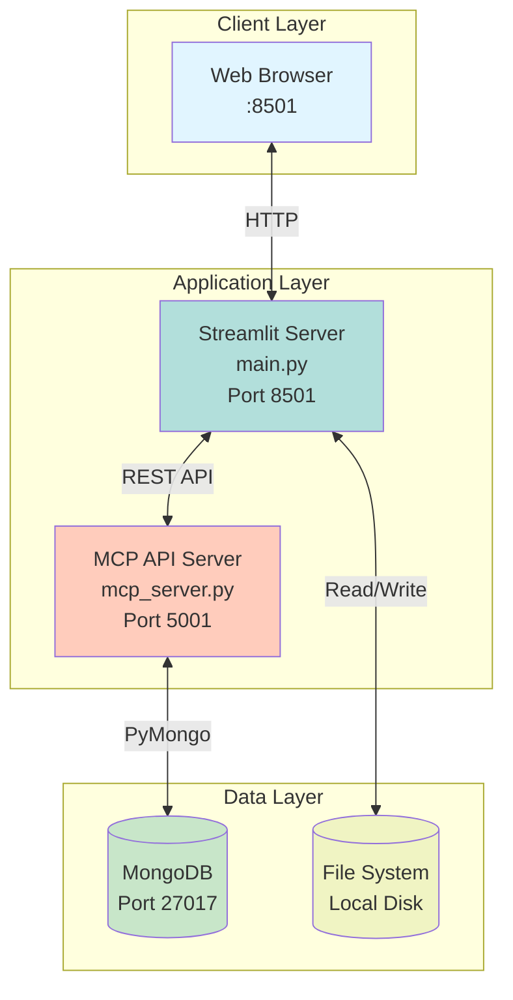

---

## 📊 Complete Data Lifecycle

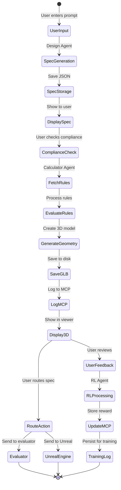

---

## 🔐 API Endpoints Map

```
MCP Server (http://localhost:5001)
│
├── POST /api/mcp/save_rule
│   └── Input: {city, clause_no, conditions, ...}
│   └── Output: {success, inserted_id}
│
├── GET /api/mcp/list_rules?limit=100
│   └── Output: {success, count, rules: [...]}
│
├── DELETE /api/mcp/delete_rule/<rule_id>
│   └── Output: {success, deleted_count}
│
├── POST /api/mcp/feedback
│   └── Input: {case_id, feedback: "up"|"down"}
│   └── Output: {success, feedback_id, reward}
│
└── POST /api/mcp/geometry
    └── Input: {case_id, file: "path/to.glb"}
    └── Output: {success, case_id, file}
```

---

## 🧪 Testing Architecture

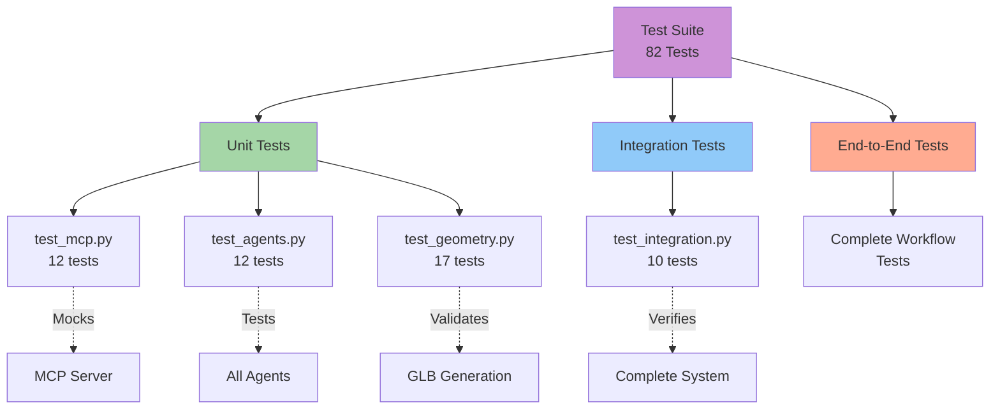

---

## 📚 Summary

This system implements a **complete data flow** from user input to 3D visualization:

1. **User Input** → Streamlit UI
2. **AI Processing** → Design Agent (JSON)
3. **Compliance** → Calculator Agent (Rules)
4. **3D Generation** → Geometry Converter (GLB)
5. **Visualization** → Three.js Viewer
6. **Feedback** → RL Agent (Learning)
7. **Storage** → MCP + MongoDB + Files
8. **Reporting** → Consolidated logs

**All components working together seamlessly!** 🎉

---

**Created**: November 5, 2025  
**System**: DCR Compliance Platform v2.0  
**Status**: ✅ Production Ready

